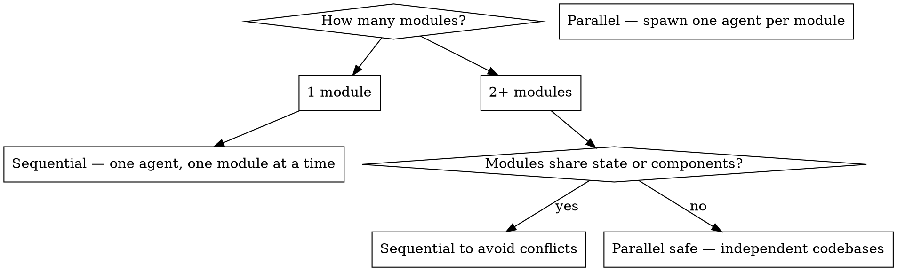

# Next.js to Nuxt Migration

## Overview

Work module by module. For each module handed to you: analyse the full flow first, verify the backend, create a task plan, then build. Never translate blindly — understand what the module does end-to-end before writing a single line of Vue code.

**Core principle:** Understand → Map → Plan → Build. In that order. Every time.

## The Iron Law

```
NEVER WRITE CODE BEFORE YOU HAVE:
  1. A submodule analysis (what it does, full data flow, all UI actions)
  2. A backend verification (which endpoints exist, which are missing)
  3. A written task plan (ordered list of what to build/fix)

NEVER DECLARE A MODULE DONE WITHOUT RUNNING THE FEATURE CHECKLIST AGAINST THE SOURCE.
```

## The Root Cause of Incomplete Ports

Claude translates what is **visible** in JSX — the template structure. It routinely misses:

- Business logic buried inside custom hooks (`useRecipients`, `useChatContext`)
- Keyboard shortcuts and `onKeyDown` handlers
- Conditional rendering paths for empty state, error state, loading state
- `useEffect` side effects (scroll restoration, focus management, analytics)
- Permission/role-based branches (`if (user.role === 'admin')`)
- Responsive behavior (`useMediaQuery`, mobile-specific logic)
- Optimistic UI updates and rollback logic
- Debounced/throttled handlers
- Form validation rules (especially cross-field rules)
- URL query param sync (`?page=2&search=foo`)
- Clipboard, drag-drop, file upload behaviors
- WebSocket/real-time subscriptions inside hooks
- `ref` forwarding and imperative handles
- Context value shape (partial consumption — only reading 2 of 10 context values)

**These are invisible in the template. You MUST read every hook and every handler — not just the JSX.**

## When to Use

- Porting a Next.js/React app to Nuxt/Vue 3
- Converting PM-built React prototypes (mock/JSON-backed) to production Vue apps
- Building NestJS backend endpoints to replace Next.js API routes
- Converting React Context state to Pinia stores

## When NOT to Use

- Migrating between different Vue versions (use `refactoring-safely`)
- Adding features to an existing Nuxt app (use `full-stack-api-integration`)
- Auditing the migrated code after porting (use `codebase-conformity`)

## Multi-Agent Strategy

Choose before starting. Do not change strategy mid-migration.



### Sequential (default — one module handed at a time)

```
User hands off module → Agent runs Phase -1 through Pass 3 → Reports done → User hands next
```

Use when:
- Modules share Pinia stores, composables, or service files
- Backend endpoints overlap (same controller)
- You want to review each module before the next starts

### Parallel (agent team — `agent-team-coordination`)

Spawn one agent per module. Each agent receives:

```
Agent brief per module:
- Module name: {module}          ← the user will provide this (e.g. recipients, campaigns, vishing)
- Source path: {react-repo}/     ← Next.js PM prototype repo the user will provide
- Target path: {nuxt-repo}/      ← Production Nuxt frontend repo the user will provide
- Backend path: {nestjs-repo}/   ← NestJS backend repo the user will provide
- Task: Run Phase -1 analysis only. Produce submodule analysis report + task plan. Do NOT write code yet.
- Constraint: Read-only during analysis. Report back before writing anything.

Example (recipients module):
- Module name: recipients
- Source path: C:/path/to/vishing-simulation-platform/
- Target path: C:/path/to/admin.humanfirewall.ai/
- Backend path: C:/path/to/admin-backend.humanfirewall.ai/
```

**When the user gives you a module name and repo paths, substitute them everywhere in this skill.** The skill uses `{module}`, `{react-repo}`, `{nuxt-repo}`, `{nestjs-repo}` as placeholders throughout.

**REQUIRED:** Analysis-only pass first. Orchestrator reviews all plans before any agent writes code. This prevents agents from creating conflicting service files or duplicate Pinia stores.

**NEVER** let parallel agents write backend code simultaneously — NestJS module registration and Prisma schema changes conflict.

## The Iron Questions (ASK BEFORE STARTING)

```
STOP. Before translating anything, answer these:

1. Does the existing Nuxt codebase already have this feature/page? (check pages/, components/, services/)
2. What Pinia store manages state for this domain? (check store/ and stores/)
3. Does the backend (NestJS) already have endpoints for this data?
4. Which Axios service file owns this domain? (check services/api/)
5. What layout does this page use? (shadcn.vue, auth.vue, admin.vue, portal.vue)
6. What permissions does this page require? (definePageMeta permission)
7. Are there existing composables for this behavior? (check composables/)
8. Which shadcn-vue component maps to the source React component? (check ~/components/ui/shadcn/ — don't create new ones)
```

If you cannot answer these from reading the codebase, READ the codebase before translating.

## Phase -1: Submodule Analysis (START HERE — EVERY MODULE)

When handed a module (e.g. "recipients", "campaigns", "vishing"), do this before anything else.

### Step 1: Understand What the Module Does

```
READ every file in the source module:
  - pages/          → what routes exist?
  - components/     → what UI pieces compose it?
  - hooks/          → what logic is encapsulated?
  - lib/data/       → what JSON operations does it do?
  - app/api/        → what backend routes does it call?

Produce a one-paragraph plain-English summary:
"This module allows users to [primary action]. It lists [data],
lets users [create/edit/delete], filters by [fields], and [special behavior].
Data comes from [source]. State is managed by [mechanism]."
```

### Step 2: Map the Full Data Flow

For every data entity in the module, trace it end-to-end:

```
| Entity | React Source | API Call | NestJS Endpoint | Prisma Model | Nuxt Target |
|--------|-------------|----------|-----------------|--------------|-------------|
| {Module} list | lib/data/{module}.ts readAll() | GET /api/{module} | GET /v1/{module} | {Model} | services/api/{module}.service.ts get{Module}s() |
| Create {module} | lib/data/{module}.ts create() | POST /api/{module} | POST /v1/{module} | {Model} | services/api/{module}.service.ts create{Module}() |
| Bulk delete | lib/data/{module}.ts bulkDelete() | POST /api/{module}/bulk | POST /v1/{module}/bulk-delete | {Model} | services/api/{module}.service.ts bulkDelete{Module}s() |

// Example (recipients):
// | Recipient list | lib/data/recipients.ts readAll() | GET /api/recipients | GET /v1/recipients | Recipient | services/api/recipients.service.ts getRecipients() |
```

### Step 3: Inventory All UI Actions

```
READ every interactive element in every component of the module.
For each one, document:

| UI Action | Trigger | What it does | State changes | API call | Missing in Nuxt? |
|-----------|---------|-------------|---------------|----------|-----------------|
| Search | type in search box | filters table | searchQuery ref | debounced GET ?search= | ? |
| Select page rows | header checkbox | selects visible rows | selectedRows Set | none | ? |
| Select ALL records | "Select all N" banner | sets selectAll flag | selectAllFlag bool | none — sent with mutation | ? |
| Bulk delete | "Delete selected" button | opens confirm modal | deleteModal open | POST /bulk-delete | ? |
| Export CSV | export button | downloads file | loading state | GET /export | ? |
| Column sort | click column header | re-sorts | sortField, sortDir | GET with sort params | ? |
| Filter by status | status dropdown | filters results | filters ref | GET with status param | ? |
| **Row action: Edit** | row "..." menu → Edit | opens edit modal/page | activeRow ref | GET /:id then PUT /:id | ? |
| **Row action: Delete** | row "..." menu → Delete | opens confirm modal | deleteTarget ref | DELETE /:id | ? |
| **Row action: Duplicate** | row "..." menu → Clone | creates copy | loading state | POST /clone/:id | ? |
| **Row action: View** | row "..." menu → View / row click | opens detail sheet | detailRow ref | GET /:id | ? |
| **Row action: Toggle status** | row "..." menu → Enable/Disable | toggles status inline | row.status | PATCH /:id/status | ? |
| Pagination | page buttons / page size | changes page | page, pageSize | GET with page params | ? |
| Empty state CTA | "Add first X" button | opens create flow | createModal open | none | ? |
| Form submit | submit button | creates/updates record | loading, errors | POST or PUT | ? |
| Form validation | on blur / on submit | shows field errors | errors ref | none | ? |
| Modal close | X button / backdrop | closes modal | modal open = false | none | ? |
```

**Row-level action menus are almost always missing.** Every table has a `...` dropdown per row — read the source's `columns` definition or `DropdownMenu` inside the row renderer to find every action. Do not skip this.

Fill the "Missing in Nuxt?" column by checking the existing Nuxt component.

### Step 3b: JSON → Server-Side Behavior Translation

The React/JSON version loads ALL data into memory. The backend has limits. Every "unlimited" React behavior needs a server-side equivalent.

**Map every assumption:**

| React/JSON Behavior | Why it worked | Server-Side Translation |
|---------------------|--------------|------------------------|
| `readAll()` returns every record | JSON file in memory | Paginated API — default page size, never load all |
| `filter(r => r.status === x)` client-side | All data loaded | `GET /v1/recipients?status=x` server filter |
| `sort(...)` client-side | All data loaded | `GET /v1/recipients?sortBy=email&order=asc` |
| "Select all" → `items.map(i => i.id)` | All IDs in memory | Two-stage: select page rows + "select all N records" flag |
| Instant search as you type | Filter in-memory | Debounced search (300ms) → server query |
| Count total from `array.length` | All records loaded | Backend returns `{ data: [], total: N }` — use `total` |
| CSV export from local array | All data in JS | Backend export endpoint streams the file |
| Bulk action on all matching | Filter in memory | Send filter params to backend, backend applies to all |

**The "Select All" Pattern — implement exactly this:**

```
Problem: React shows "select all 3 rows on this page" via checkbox.
         Backend has 500 records across 50 pages.

Solution: Two-level selection UI

Level 1 — Select page rows (default checkbox behavior):
  selectedIds = Set of IDs visible on current page

Level 2 — "Select all N records" banner (appears when all page rows selected):
  "All 20 rows on this page are selected. Select all 500 recipients?"
  → sets selectAll = true (a boolean flag, not an ID list)
  → bulk actions send { selectAll: true, filters: currentFilters } to backend
  → backend applies action to all matching records server-side

Never try to load all IDs to the frontend for "select all".
```

**Pagination — always server-side:**

```typescript
// Nuxt composable pattern
const page = ref(1)
const pageSize = ref(20)
const total = ref(0)
const items = ref([])

const fetch = async () => {
  const res = await getRecipients({ page: page.value, pageSize: pageSize.value, ...filters })
  items.value = res.data
  total.value = res.total  // always from backend
}

watch([page, pageSize, filters], fetch, { immediate: true })
```

### Step 4: Backend Verification

```
For every API call identified above:

| Endpoint | Exists in NestJS? | Controller File | Notes |
|----------|------------------|-----------------|-------|
| GET /v1/recipients | ✅ YES | recipients.controller.ts | Has pagination? |
| POST /v1/recipients | ✅ YES | recipients.controller.ts | — |
| POST /v1/recipients/bulk-delete | ❌ NO | — | Must create |
| GET /v1/recipients/export | ❌ NO | — | Must create |

For missing endpoints, note:
- What DTO is needed?
- What Prisma query?
- What permission check?
```

### Step 5: Produce the Task Plan

Only after Steps 1–4 are complete, produce a numbered task list:

```
## Task Plan: [Module Name]

### Backend (build first — frontend depends on it)
- [ ] B1. Create BulkDeleteRecipientsDto + POST /v1/recipients/bulk-delete endpoint
- [ ] B2. Create GET /v1/recipients/export endpoint (returns CSV stream)

### Frontend — Missing Features (fix existing ported component)
- [ ] F1. Add search with debounce — wire to GET /v1/recipients?search=
- [ ] F2. Add "select all" checkbox — selectedRows Set, bulk action toolbar
- [ ] F3. Add bulk delete flow — confirm modal → B1 endpoint → refetch
- [ ] F4. Add CSV export button → B2 endpoint → browser download
- [ ] F5. Add column sort — sortField/sortDir state → re-query
- [ ] F6. Add status filter dropdown → filters state → re-query

### Frontend — New Pages (not yet ported)
- [ ] F7. Port recipients/[id]/detail page
- [ ] F8. Port recipients/import page

### Verification
- [ ] V1. Every UI action from Step 3 works end-to-end
- [ ] V2. No direct fetch() calls remain — all through service files
- [ ] V3. All backend endpoints return correct data shapes
```

Present this plan to the user and get approval before writing any code.

## Multi-Pass Execution (Run for Every Module)

Each module requires multiple passes. Never declare a module done after one pass.

```
Pass 1 — Backend wiring (make features work at all)
  - Create missing NestJS endpoints
  - Wire Nuxt service files to real API
  - Replace any remaining JSON/mock reads
  - Server-side pagination, filtering, sorting in place
  - Row-level actions wired (edit, delete, clone, toggle)
  - Bulk actions wired (including "select all N" flag)
  Goal: Every feature WORKS. Ugly is acceptable.

Pass 2 — Feature completeness (match source feature-for-feature)
  - Re-run Phase 0 feature inventory against the source
  - Tick every checkbox — implement any still missing
  - Empty state, error state, loading skeleton present
  - Form validation matches source rules exactly
  - Keyboard shortcuts, debounce, URL param sync
  Goal: Nothing missing. No "I'll add that later."

Pass 3 — CSS and visual polish (see "UI Design Patterns" section for rules)
  - Large modal → convert to USlideover; wrap body in <div class="space-y-6 p-6">
  - Check slideover padding: content must not touch the edges
  - Match font color/size/contrast: headings gray-900, secondary gray-500/muted-foreground
  - Metric/stat cards must have gradient backgrounds (see UI Design Patterns)
  - Match spacing, typography, color to the production Nuxt design system
  - Responsive breakpoints work (mobile/tablet/desktop)
  - Loading skeletons match the content shape
  - Animations/transitions present where source had them
  - Row hover states, selected states, disabled states styled correctly
  - Compare component visually against existing Nuxt pages for consistency
  Goal: Looks production-grade, consistent with the rest of the app.

Pass 4 — Verification
  - Run the feature checklist: every UI action works end-to-end
  - Open browser, visit every route in the module
  - Trigger every error state (network off, invalid input, empty data)
  - Confirm no console errors
  - Confirm no direct fetch() calls remain
  - Confirm all backend endpoints protected by correct @CheckAbility guards
  Goal: Zero regressions, zero placeholders, zero console errors.
```

**Never compress passes.** "I'll do CSS while adding features" = missed features AND bad CSS.

## Phase 0: Feature Inventory (DO THIS BEFORE EVERY COMPONENT)

This is the step that prevents "100 features missing after 10 reviews." Do it for every component or page being ported — no exceptions.

```
For EACH source component/page:

1. READ the file completely — template, script, and every imported hook/util
2. READ every custom hook it uses — open the file, read every line
3. BUILD this checklist before writing any Vue code:

### Feature Inventory: [ComponentName]

#### Data & State
- [ ] What data does it fetch? (list every API call / JSON read)
- [ ] What local state does it manage? (every useState / useReducer)
- [ ] What does it derive/compute? (every useMemo / derived value)
- [ ] What does it read from global state? (every useContext / store selector)
- [ ] What does it write to global state?
- [ ] Does it sync state to URL params?
- [ ] Does it persist anything to localStorage/sessionStorage?

#### Interactions
- [ ] What does each button/link/icon do?
- [ ] Are there keyboard shortcuts or onKeyDown handlers?
- [ ] Is there drag-and-drop?
- [ ] Is there file upload or clipboard access?
- [ ] Are there debounced/throttled handlers?
- [ ] Are there form fields? List every validation rule including cross-field rules.
- [ ] Are there optimistic updates with rollback?

#### Visual States
- [ ] Loading state — how is it shown?
- [ ] Error state — what triggers it, how is it displayed?
- [ ] Empty state — what does it look like?
- [ ] Disabled state — which elements, under what conditions?
- [ ] Selected / active state
- [ ] Mobile / responsive behavior
- [ ] Any animations or transitions?

#### Side Effects
- [ ] What runs on mount? (every useEffect with [])
- [ ] What runs when a dependency changes? (every useEffect with deps)
- [ ] What runs on unmount? (cleanup functions)
- [ ] Does it subscribe to WebSocket events?
- [ ] Does it set page title, meta tags, or document properties?
- [ ] Does it call analytics/tracking?

#### Permissions & Conditions
- [ ] What permission/role checks exist?
- [ ] Are any sections conditionally rendered by feature flag?
- [ ] Are there workspace/tenant conditions?

#### Events Emitted / Callbacks
- [ ] What does it emit to its parent? (every onXxx prop / callback)

4. PRESENT this list to the user before writing any code.
5. AFTER porting, go through EVERY item and confirm it is implemented.
6. Do NOT mark the component done until every checkbox is ticked.
```

**Shortcut rationalizations to reject:**

| Thought | Reality |
|---------|---------|
| "I read the component, I know what it does" | You read the template. Read every hook too. |
| "The hook is simple" | Open it. Read it. Do not assume. |
| "I'll add the missing features in a follow-up" | There is no follow-up. Do it now. |
| "The feature inventory is overkill for a small component" | The 100 missing features were all in "small components" |

## Phase 1: Build the Migration Map

```
For EVERY file in the source Next.js project:

| Source File | Source Pattern | Target File | Target Pattern | Backend Needed? |
|-------------|---------------|-------------|----------------|-----------------|
| app/recipients/page.tsx | React page + useState | pages/recipients/index.vue | Nuxt page + Pinia | GET /recipients |
| app/api/recipients/route.ts | Next.js API route | NestJS RecipientsController | @Get() + service | Yes |
| components/ui/button.tsx | shadcn/ui Button | Already exists in components/ui/shadcn/ | Reuse | No |
| lib/data/recipients.ts | JSON CRUD | services/api/recipients.service.ts | Axios + Prisma | Yes |
| lib/ai-chat/chat-context.tsx | React Context | stores/chat.store.ts | Pinia store | Maybe |

PRESENT this map before writing any code.
```

## Phase 2: Concept Translation Reference

### Components

```
// REACT (Next.js)
interface Props {
  title: string
  count?: number
}

export function MyComponent({ title, count = 0 }: Props) {
  const [open, setOpen] = useState(false)

  useEffect(() => {
    console.log('mounted')
  }, [])

  return <div onClick={() => setOpen(true)}>{title}</div>
}

// VUE (Nuxt 4) — use this pattern
<script setup lang="ts">
interface Props {
  title: string
  count?: number
}

const props = withDefaults(defineProps<Props>(), { count: 0 })
const emit = defineEmits<{ 'update:open': [value: boolean] }>()

const open = ref(false)

onMounted(() => {
  console.log('mounted')
})
</script>

<template>
  <div @click="open = true">{{ props.title }}</div>
</template>
```

### Hooks → Composables

| React Hook | Vue/Nuxt Equivalent | Notes |
|------------|--------------------|-|
| `useState` | `ref()` / `reactive()` | Primitive → ref, object → reactive |
| `useEffect(() => fn, [])` | `onMounted(fn)` | Runs once on mount |
| `useEffect(() => fn, [dep])` | `watch(dep, fn)` | Reactive dependency |
| `useEffect(() => fn, [dep])` (immediate) | `watchEffect(fn)` | Auto-tracks deps |
| `useMemo(() => val, [dep])` | `computed(() => val)` | Cached derived value |
| `useCallback(fn, [dep])` | Plain function in setup | No equivalent needed |
| `useRef(null)` | `const el = ref<HTMLElement>()` | DOM ref |
| `useRouter()` | `useRouter()` from `vue-router` | Same name, different import |
| `useContext(AuthCtx)` | `useAuthStore()` | Pinia store replaces context |
| `useContext(ThemeCtx)` | `useColorMode()` (Nuxt built-in) | Use Nuxt composable |

### State: React Context → Pinia

```typescript
// REACT — Context
const AuthContext = createContext<AuthState | null>(null)

export function AuthProvider({ children }: { children: ReactNode }) {
  const [user, setUser] = useState<User | null>(null)
  return <AuthContext.Provider value={{ user, setUser }}>{children}</AuthContext.Provider>
}

export const useAuth = () => useContext(AuthContext)!

// VUE — Pinia store (Composition API pattern — match existing stores/)
// File: stores/auth.ts
export const useAuthStore = defineStore('auth', () => {
  const user = ref<User | null>(null)
  const isAuthenticated = computed(() => !!user.value)

  const login = async (email: string, otp: string) => { /* ... */ }
  const logout = () => { user.value = null }

  return { user, isAuthenticated, login, logout }
})

// Usage in component — same as useAuth() hook
const authStore = useAuthStore()
```

### Routing

| Next.js App Router | Nuxt 4 |
|-------------------|--------|
| `app/page.tsx` | `pages/index.vue` |
| `app/{module}/page.tsx` | `pages/{module}/index.vue` |
| `app/{module}/[id]/page.tsx` | `pages/{module}/[id].vue` |
| `app/{module}/layout.tsx` | `definePageMeta({ layout: 'shadcn' })` in each page |
| `app/api/foo/route.ts` | NestJS controller (separate backend) |
| `<Link href="/foo">` | `<NuxtLink to="/foo">` |

**Page template (required on every page):**
```vue
<script setup lang="ts">
definePageMeta({
  layout: 'shadcn',    // always 'shadcn' for admin pages
  ssr: false,          // always false — Nuxt is SPA mode
  permission: { action: 'read', subject: '{Model}' },  // CASL — match backend entity name
})
</script>
```

### Navigation Patterns (Nuxt 4)

Three navigation methods exist in the codebase. Use each in the right context:

```typescript
// 1. navigateTo() — Nuxt built-in composable
// Use for: programmatic nav after async operations (form submit, button click)
// Works ONLY inside setup() or composables — NOT in plain functions called outside Vue context
await navigateTo('/recipients')
await navigateTo(`/recipients/${id}`)
navigateTo('/login')  // no await needed for non-blocking nav

// 2. useRouter().push() — Vue Router
// Use for: programmatic nav where you already have the router instance
// Works anywhere you can call useRouter() (setup, composables)
const router = useRouter()
router.push(`/recipients/${row.id}`)
router.push({ path: '/recipients', query: { page: '2', s
