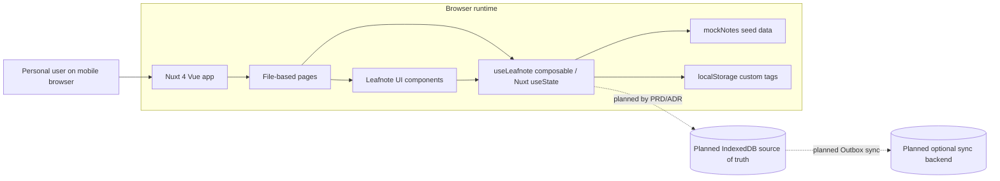
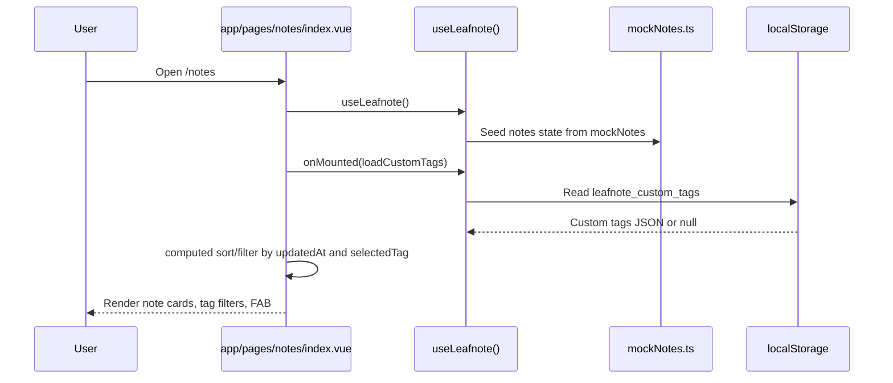
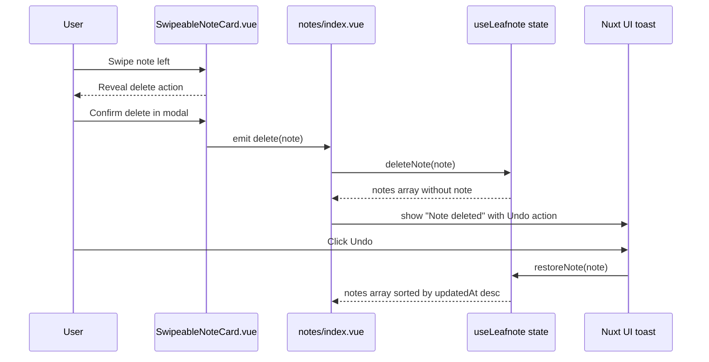
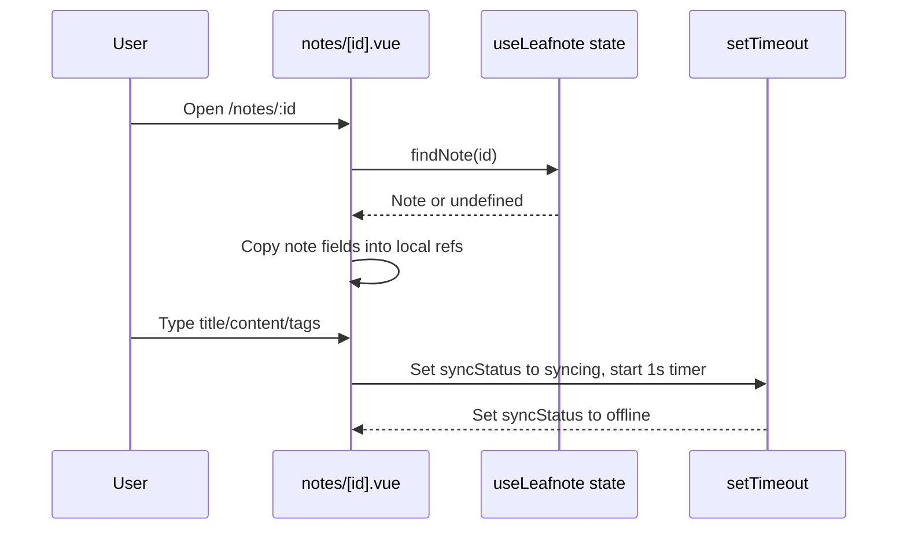
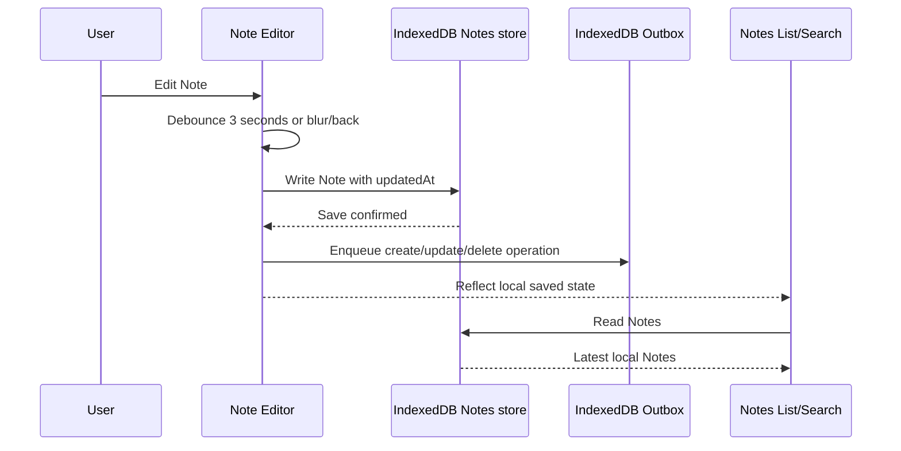

# Architecture Overview

Leafnote is a Nuxt 4 mobile web application for personal, local-first note taking. The current repository contains a frontend-only prototype implemented with Vue 3 Single-File Components, Nuxt file-based routing, Nuxt UI, Tailwind CSS 4, and TypeScript.

The product direction documented in the repository is local-first: notes should eventually persist in IndexedDB and sync should be optional. The current code has not implemented IndexedDB, a backend, real authentication, or real sync. Runtime state is currently held in Nuxt `useState`; custom tags are stored in `localStorage`; notes come from mock data.

## 1. Project Structure

```text
.
├── app/
│   ├── app.vue                         # Nuxt root app wrapper, SEO metadata, UApp provider, NuxtPage outlet
│   ├── app.config.ts                   # Nuxt UI app config, icon aliases
│   ├── assets/css/main.css             # Tailwind CSS 4 imports, Nuxt UI import, Leafnote design tokens/utilities
│   ├── components/leafnote/            # Leafnote feature UI components
│   │   ├── AppleLogo.vue               # Apple SVG logo used by sign-in screen
│   │   ├── EditorToolbar.vue           # Bottom editor toolbar placeholder buttons
│   │   ├── EmptyState.vue              # Empty notes list state
│   │   ├── FloatingActionButton.vue    # New Note floating action button
│   │   ├── GoogleLogo.vue              # Google SVG logo used by sign-in screen
│   │   ├── LeafIcon.vue                # Leafnote SVG brand icon
│   │   ├── NoteCard.vue                # Read-only note summary card
│   │   ├── SwipeableNoteCard.vue       # Mobile swipe-to-delete note card with confirmation modal
│   │   ├── SyncIndicator.vue           # Idle/syncing/offline visual status component
│   │   ├── TagBadge.vue                # Tag chip with optional remove action
│   │   ├── TagFilter.vue               # Horizontal tag filter list for notes index
│   │   └── TagPicker.vue               # Tag selection and custom tag entry UI
│   ├── composables/
│   │   ├── formatTimeAgo.ts            # Relative time formatting helper
│   │   └── useLeafnote.ts              # Current client state facade for notes/tags/delete/restore
│   ├── data/mockNotes.ts               # Seed/mock notes used as current note source
│   ├── pages/
│   │   ├── index.vue                   # Welcome screen at `/`
│   │   ├── notes/index.vue             # Notes List screen at `/notes`
│   │   ├── notes/[id].vue              # Note Editor screen at `/notes/:id`; `new` is used for new note route
│   │   ├── search.vue                  # Search screen at `/search`
│   │   ├── settings.vue                # Settings screen at `/settings`
│   │   └── signin.vue                  # Sign-in placeholder screen at `/signin`
│   └── types/note.ts                   # Note, SyncStatus, default tags, localStorage key constants
├── docs/
│   ├── adr/
│   │   ├── 0001-indexeddb-as-local-source-of-truth.md
│   │   └── 0002-last-write-wins-sync-conflicts.md
│   ├── issues/0001-leafnote-mvp-issues.md
│   └── prd/0001-prd-mvp.md
├── CONTEXT.md                          # Domain language and concept definitions
├── nuxt.config.ts                      # Nuxt modules, CSS entry, prerender rule, compatibility date, ESLint style config
├── package.json                        # Scripts and dependencies
├── pnpm-workspace.yaml                 # pnpm workspace config
├── pnpm-lock.yaml                      # Locked dependency graph
├── tsconfig.json                       # TypeScript project references generated by Nuxt
├── eslint.config.mjs                   # ESLint config wrapping Nuxt generated config
├── .github/workflows/ci.yml            # GitHub Actions lint/typecheck workflow
├── public/favicon.ico                  # Static favicon
├── renovate.json                       # Renovate dependency update config
├── README.md                           # Still contains Nuxt starter template content
└── LICENSE
```

Generated/build directories exist locally but are not source architecture:

- `.nuxt/`: Nuxt generated types, dev/build metadata, component auto-import metadata, and Nuxt UI generated theme files.
- `.output/`: Nitro production build output from `nuxt build`.
- `node_modules/`: installed dependencies.

## 2. High-Level System Diagram



Current hard boundaries:

- There is one Nuxt frontend application.
- There is no backend or server API implemented in the repository.
- There is no real persistent notes database implemented in the repository.
- There are no external service calls for auth or sync implemented in the repository.

## 3. Core Components

### 3.1 Frontend / User Interface

**Framework and rendering model**

- Framework: Nuxt `^4.4.6` with Vue 3 Composition API.
- Rendering: Nuxt app with file-based routing. `nuxt.config.ts` prerenders `/` through `routeRules: { '/': { prerender: true } }`. Other routes use Nuxt defaults; the exact deployment mode is not specified in the repository.
- Root wrapper: `app/app.vue` uses `UApp` from Nuxt UI and renders `NuxtPage`.

**Routing/page structure**

Nuxt file routes are defined by files in `app/pages`:

| Route | File | Responsibility |
|---|---|---|
| `/` | `app/pages/index.vue` | Welcome screen with Get Started and Sign in to sync actions |
| `/signin` | `app/pages/signin.vue` | OAuth-style sign-in placeholder screen with Google/Apple buttons |
| `/notes` | `app/pages/notes/index.vue` | Notes list, sync indicator, tag filters, search/settings navigation, FAB |
| `/notes/:id` | `app/pages/notes/[id].vue` | Editor for existing note IDs and `new` route for new note draft |
| `/search` | `app/pages/search.vue` | Local in-memory search over title/body |
| `/settings` | `app/pages/settings.vue` | Account/sync/app/privacy settings placeholder |

Navigation uses Nuxt `navigateTo()` directly in page event handlers.

**Component organization**

All feature components live under `app/components/leafnote/`. Nuxt auto-imports these components, so templates reference names like `LeafnoteLeafIcon`, `LeafnoteTagFilter`, and `LeafnoteSwipeableNoteCard` without local imports.

Architectural component groups:

- Brand and auth visuals: `LeafIcon.vue`, `GoogleLogo.vue`, `AppleLogo.vue`.
- Notes list UI: `NoteCard.vue`, `SwipeableNoteCard.vue`, `EmptyState.vue`, `FloatingActionButton.vue`.
- Editor UI: `EditorToolbar.vue`, tag button/sheet composition in `pages/notes/[id].vue`.
- Tags: `TagBadge.vue`, `TagFilter.vue`, `TagPicker.vue`.
- Status: `SyncIndicator.vue`.

**State management**

`app/composables/useLeafnote.ts` is the current state facade:

- `notes`: Nuxt `useState<Note[]>('leafnote-notes', () => [...mockNotes])` seeded from `app/data/mockNotes.ts`.
- `customTags`: Nuxt `useState<string[]>('leafnote-custom-tags', () => [])`.
- `allTags`: computed union of `DEFAULT_TAGS` and `customTags`.
- `loadCustomTags()`: reads `CUSTOM_TAGS_KEY` from `localStorage` on client only.
- `addCustomTag(tag)`: normalizes and stores custom tags in `localStorage`.
- `findNote(id)`: finds a note in current state.
- `deleteNote(note)`: removes a note from current state.
- `restoreNote(note)`: restores a note and sorts by newest `updatedAt`.

Important limitation: note edits made in `app/pages/notes/[id].vue` currently update local refs (`title`, `content`, `tags`) but do not write back to `notes` or persistent storage. This is prototype behavior.

**Data access pattern**

Current data access is local-only and in-memory for notes:

- Initial notes come from `mockNotes`.
- Tags are partly persistent via browser `localStorage`.
- There are no `$fetch`, REST, GraphQL, server routes, or SDK calls in the current app code.

**Styling/design system**

- Nuxt UI is installed as a module and imported through `@nuxt/ui` CSS.
- Tailwind CSS 4 is imported in `app/assets/css/main.css`.
- Leafnote-specific CSS variables implement a warm neutral and sage green visual system:
  - `--background`, `--foreground`, `--card`, `--primary`, `--secondary`, `--muted`, `--destructive`, `--border`, etc.
  - Leaf palette: `--leaf-50` through `--leaf-700`.
  - Writing tokens: `--paper`, `--ink`, `--ink-faint`.
  - Sync tokens: `--sync-idle`, `--sync-syncing`, `--sync-offline`.
- Custom Tailwind utilities map CSS variables to class names such as `bg-background`, `text-foreground`, `bg-leaf-500`, and `text-sync-offline`.
- Animations and mobile safe area utilities live in `main.css`: `animate-fade-up`, `animate-fade-in`, `animate-slide-up`, `animate-scale-in`, `safe-top`, `safe-bottom`, `focus-ring`, `scrollbar-hide`.
- Fonts are loaded in `app/app.vue` via Google Fonts links for Inter and Source Serif 4. Nuxt build output also shows `@nuxt/fonts` downloading these fonts during build, but explicit module configuration is not present in `nuxt.config.ts`.

### 3.2 Backend / Server / API

No application backend is implemented in the repository.

Nuxt/Nitro is present because Nuxt builds a server bundle by default, but there are no source files under `server/`, no API routes, no middleware, no database adapters, and no backend service layer.

Backend-related items that are not evident from the repository:

- API routing/controllers
- Persistence layer
- Authentication callbacks
- Authorization model
- Background jobs/workers
- Webhooks
- Server-side validation
- Server deployment target

### 3.3 Shared Libraries / Common Code

**Domain types**

`app/types/note.ts` defines:

```ts
export interface Note {
  id: string
  title: string
  content: string
  tags: string[]
  createdAt: Date
  updatedAt: Date
  syncStatus: 'synced' | 'pending' | 'local'
}

export type SyncStatus = 'idle' | 'syncing' | 'offline'
```

It also defines `DEFAULT_TAGS` and `CUSTOM_TAGS_KEY`.

**Time formatting helper**

`app/composables/formatTimeAgo.ts` formats `Date` values into strings such as `2 days ago`. It is used by `NoteCard.vue` and `SwipeableNoteCard.vue`.

**Mock data**

`app/data/mockNotes.ts` contains five sample notes with titles, content, tags, dates, and sync statuses. This currently acts as the application’s seed data and temporary data source.

### 3.4 CLI / Scripts / Automation

`package.json` defines:

| Command | Purpose |
|---|---|
| `pnpm dev` | Start Nuxt dev server |
| `pnpm build` | Build Nuxt production output |
| `pnpm preview` | Preview production build |
| `pnpm postinstall` | Run `nuxt prepare` to generate Nuxt artifacts |
| `pnpm lint` | Run ESLint over repository |
| `pnpm typecheck` | Run Nuxt type checking |

`.github/workflows/ci.yml` runs on every push on Ubuntu with Node 22. It installs dependencies, then runs `pnpm run lint` and `pnpm run typecheck`. It does not run tests or production build.

## 4. Data Flow

### 4.1 Current notes list read flow



### 4.2 Current delete/undo flow



Current delete only mutates in-memory Nuxt state. It does not write a Tombstone or persist deletion.

### 4.3 Current editor flow



Important limitation: the current editor flow does not save changes back to `useLeafnote().notes` or browser storage.

### 4.4 Current search flow

`app/pages/search.vue` reads `notes` from `useLeafnote()`, computes `filteredNotes` when `query` changes, and matches only `note.title` and `note.content`. It renders `NoteCard` results and navigates to `/notes/:id` when a result is selected.

### 4.5 Planned MVP local-first flow

The PRD and ADRs define a future architecture not yet implemented:



This planned flow is documented but not yet present in app code.

## 5. Data Stores

### 5.1 Nuxt useState

- Type/technology: Nuxt `useState` reactive state.
- Purpose: Current runtime state for `notes` and `customTags`.
- Owner: `app/composables/useLeafnote.ts`.
- Persistence: SSR/client runtime state only. Notes do not persist after full browser reload unless re-seeded from `mockNotes`.
- Schema: `Note[]` and `string[]`.

### 5.2 Browser localStorage

- Type/technology: Browser `localStorage`.
- Purpose: Stores custom tag names under key `leafnote_custom_tags`.
- Owner: `app/composables/useLeafnote.ts` through `loadCustomTags()` and `saveCustomTags()`.
- Schema: JSON-encoded `string[]`.
- Error handling: Invalid JSON is caught and ignored by resetting custom tags to `[]`.
- Lifecycle: No retention, migration, backup, or cleanup strategy is implemented.

### 5.3 Mock notes module

- Type/technology: Static TypeScript module.
- Purpose: Prototype seed data.
- Owner: `app/data/mockNotes.ts`.
- Schema: `Note[]` with `Date` objects.
- Lifecycle: Recreated whenever app state initializes.

### 5.4 Planned IndexedDB

- Type/technology: IndexedDB.
- Purpose: Planned source of truth for Notes, Tags, Outbox entries, Tombstones/delete records, and sync metadata.
- Evidence: `docs/adr/0001-indexeddb-as-local-source-of-truth.md`, `docs/prd/0001-prd-mvp.md`, `docs/issues/0001-leafnote-mvp-issues.md`.
- Implementation status: Not implemented in app code.

No SQL database, NoSQL database, ORM, migration tool, or remote persistence layer is present in the repository.

## 6. External Integrations / APIs

### 6.1 Nuxt UI

- Purpose: UI component system and application shell utilities such as `UApp`, `UIcon`, `UModal`, `USlideover`, `USeparator`, and Nuxt UI toast composable.
- Integration method: Nuxt module configured in `nuxt.config.ts` and CSS import in `app/assets/css/main.css`.
- Authentication: None.
- Failure/retry behavior: Not applicable.

### 6.2 Iconify icon packages

- Packages: `@iconify-json/lucide` and `@iconify-json/simple-icons`.
- Purpose: Local icon collections consumed through Nuxt UI `UIcon` names like `i-lucide-search`.
- Integration method: npm packages installed as dependencies; Nuxt Icon discovers local collections during build.

### 6.3 Google Fonts

- Purpose: Load Inter and Source Serif 4 fonts.
- Integration method: `app/app.vue` adds preconnect and stylesheet links to `fonts.googleapis.com` and `fonts.gstatic.com`.
- Authentication: None.
- Failure behavior: Not handled explicitly; browser fallback fonts are specified in CSS.

### 6.4 Planned OAuth providers

The sign-in UI shows Google and Apple buttons and simulates sign-in with a 1 second timeout before navigating to `/notes`. No OAuth SDK, callback route, token handling, or provider configuration exists in the repository.

OAuth is therefore planned by PRD/prototype UI, not implemented architecture.

### 6.5 No application APIs

There are no first-party API routes, REST calls, GraphQL calls, webhooks, or message queues in the source code.

## 7. Key Technologies

| Technology | Evidence | Architectural role |
|---|---|---|
| TypeScript | `.vue` scripts, `app/types/note.ts`, `tsconfig.json` | Typed app code and domain interfaces |
| Vue 3 | Nuxt dependency and SFCs | Component model and reactive UI |
| Nuxt 4.4.6 | `package.json`, `nuxt.config.ts` | Application framework, routing, build, Nitro output |
| Nuxt UI 4.7.1 | `package.json`, `nuxt.config.ts`, `U*` components | UI component library and provider system |
| Tailwind CSS 4.3 | `package.json`, `main.css` | Utility styling and theme token integration |
| Iconify local icon JSON | `@iconify-json/lucide`, `@iconify-json/simple-icons` | Icon source for UI controls |
| pnpm 11.1.3 | `package.json`, lockfile | Package manager and workspace install model |
| ESLint 10 + @nuxt/eslint | `package.json`, `eslint.config.mjs` | Linting and code style quality gate |
| vue-tsc / Nuxt typecheck | `package.json` scripts | Type checking for Vue/Nuxt code |
| GitHub Actions | `.github/workflows/ci.yml` | CI lint/typecheck on push |
| Renovate | `renovate.json` | Dependency update automation configuration |

Testing frameworks are not present in `package.json`.

## 8. Deployment & Infrastructure

Build and packaging:

- `pnpm build` runs `nuxt build`.
- Nuxt produces `.output/` Nitro server output when built locally.
- `.output/server/index.mjs` is the Nitro server entry in the generated build output.
- `.output/public/` contains static client assets and prerendered files.

Configuration:

- `nuxt.config.ts` sets modules, CSS entry, devtools, route rule for `/`, compatibility date, and ESLint style options.
- No `runtimeConfig` values are defined.
- No environment variables are referenced by source code.

CI/CD:

- `.github/workflows/ci.yml` runs on push.
- CI uses Node 22 and pnpm.
- CI runs install, lint, and typecheck.
- CI does not run `pnpm build`, tests, deployment, or preview publishing.

Hosting/deployment target:

- Not evident from the repository.
- README still contains generic Nuxt starter deployment text and a Vercel template badge, but there is no project-specific Vercel, Netlify, Docker, or infrastructure configuration.

Containerization/infrastructure-as-code:

- Not evident from the repository.
- No Dockerfile, docker-compose, Terraform, Pulumi, or cloud configuration is present.

## 9. Security Architecture

Current implemented security controls are minimal because this is a frontend prototype.

Authentication:

- Not implemented.
- `app/pages/signin.vue` simulates Google/Apple sign-in with local loading state and `setTimeout`.
- No OAuth provider SDK, session handling, token storage, callback route, or server-side auth validation exists.

Authorization:

- Not implemented.
- There is no role or permission model.

Secrets management:

- Not evident from the repository.
- No environment variables or secret files are referenced by source code.

Input validation:

- Minimal client-side normalization exists for custom tags: trim and lowercase in `TagPicker.vue`/`useLeafnote.ts` flow.
- No schema validation library is present.
- Note title/content inputs do not have validation beyond Vue binding and empty-note logic planned in docs.

Sensitive data handling:

- Current notes are mock data.
- Custom tags are stored in localStorage.
- Real note persistence is not yet implemented.
- End-to-end encryption is explicitly not claimed in the PRD.

Transport/security headers/CSP/CORS:

- Not evident from the repository.
- No server middleware, CSP config, security headers, or CORS config is present.

Dependency/supply chain:

- Dependencies are locked in `pnpm-lock.yaml`.
- Renovate config exists, but its contents were not needed to determine runtime architecture.
- CI lint/typecheck runs on push.

Trust boundaries:

- Current application runs entirely in the browser plus Nuxt runtime.
- Planned future boundary: browser IndexedDB local source of truth and optional backend sync. Backend not present.

## 10. Monitoring & Observability

Logging:

- No logging architecture is present.
- Editor toolbar placeholder actions call `console.log('Bold clicked')`, `console.log('Heading clicked')`, and `console.log('Checklist clicked')`.

Metrics/tracing/error reporting:

- Not evident from the repository.
- No Sentry, OpenTelemetry, analytics, metrics, or tracing packages are present.

Health checks:

- Not evident from the repository.
- No server health endpoint exists.

Debug tooling:

- Nuxt devtools are enabled in `nuxt.config.ts` with `devtools: { enabled: true }`.
- Browser devtools can inspect localStorage custom tags and Nuxt UI state during development.

Observability gaps:

- No production error reporting.
- No client-side event logs.
- No sync diagnostics because sync is not implemented.
- No persistence migration diagnostics because IndexedDB is not implemented.

## 11. Performance & Scalability

Current performance characteristics:

- Notes are stored in a small in-memory array seeded from `mockNotes`.
- Notes list sorting and tag filtering are computed client-side in `app/pages/notes/index.vue`.
- Search filters all notes client-side in `app/pages/search.vue`.
- There is no pagination, virtualization, indexing, batching, or background processing.
- UI uses CSS transitions and simple animations.
- Nuxt route `/` is configured for prerendering.

Current scalability assumptions:

- The prototype assumes a small personal note collection.
- Client-side full-array search/sort/filter will become a bottleneck for large collections once real persistence is added.
- Planned IndexedDB architecture should eventually enable indexed reads, but indexes are not implemented yet.

Known performance-sensitive areas:

- `filteredNotes` in Notes List sorts a new copy of the full notes array on every dependency change.
- Search scans every note title/content on every query change.
- `SwipeableNoteCard.vue` handles touch movement per card and updates transform state during gestures.

Caching:

- No explicit application caching is implemented.
- Browser and Nuxt build asset caching depend on deployment platform, not configured in repository.

## 12. Development Workflow

Prerequisites:

- Node 22 is used in CI.
- pnpm 11.1.3 is specified by `packageManager` in `package.json`.

Install:

```bash
pnpm install
```

Run local development server:

```bash
pnpm dev
```

Build production output:

```bash
pnpm build
```

Preview production output:

```bash
pnpm preview
```

Lint:

```bash
pnpm lint
```

Typecheck:

```bash
pnpm typecheck
```

Generated artifacts:

- `pnpm postinstall` runs `nuxt prepare`, producing `.nuxt/` generated types/config.
- `pnpm build` produces `.output/`.

Data setup:

- No database setup or migrations are required for the current prototype.
- Mock notes live in `app/data/mockNotes.ts`.
- Custom tags can be reset by clearing browser localStorage key `leafnote_custom_tags`.

## 13. Testing Strategy

Current automated tests:

- Not evident from the repository.
- No unit, integration, component, or E2E test framework is listed in `package.json`.
- CI runs lint and typecheck only.

Planned testing work:

- `docs/issues/0001-leafnote-mvp-issues.md` includes “Issue 10: Add Local-first Regression Tests”.
- Planned coverage includes persistence across reload, autosave, blur/back save, empty note discard, delete/undo, tombstone write, tag filtering, and title/body search.

Testing gaps:

- No tests for routing.
- No tests for composable state behavior.
- No tests for mobile swipe gestures.
- No tests for Nuxt UI modal/slideover behavior.
- No tests for localStorage custom tag persistence.

## 14. Architectural Decisions & Rationale

### Decision: Nuxt 4 + Vue 3 frontend

- Evidence: `package.json`, `nuxt.config.ts`, `app/pages`, Vue SFCs.
- Rationale: Not documented in repository.
- Consequences: File-based routing, Nuxt auto-imports, Nitro build output, and Vue Composition API structure shape the application.

### Decision: Nuxt UI component system

- Evidence: `@nuxt/ui` dependency, module in `nuxt.config.ts`, `UApp`, `UIcon`, `UModal`, `USlideover`, `USeparator`, `useToast` usage.
- Rationale: Not documented beyond starter README template.
- Consequences: UI behavior and overlay/toast systems depend on `UApp`; component slot/prop APIs follow Nuxt UI conventions.

### Decision: Leafnote-specific CSS variable theme

- Evidence: `app/assets/css/main.css` defines product tokens and custom utilities.
- Rationale: PRD calls for calm, neutral, writing-focused visual style.
- Consequences: Many templates use custom classes like `bg-background`, `text-foreground`, and `bg-leaf-500`; changing theme requires updating CSS variables/utilities.

### Decision: Current state facade in `useLeafnote`

- Evidence: `app/composables/useLeafnote.ts` owns notes/customTags operations used by pages.
- Rationale: Not documented.
- Consequences: Pages depend on a single composable for note/tag state. Future IndexedDB implementation should likely preserve this facade to avoid touching every page.

### Decision: IndexedDB as future local source of truth

- Evidence: `docs/adr/0001-indexeddb-as-local-source-of-truth.md`, PRD, local issues.
- Rationale: Leafnote must work fully before account/network and needs room for autosave, Outbox, tombstones, and future sync metadata.
- Consequences: Future work should replace mock/in-memory notes with IndexedDB-backed reads/writes. localStorage should not become the note data store.

### Decision: Last-write-wins future sync conflicts

- Evidence: `docs/adr/0002-last-write-wins-sync-conflicts.md`.
- Rationale: Leafnote is personal-only, not collaborative, so MVP avoids conflict UI and merge complexity.
- Consequences: Future sync can overwrite edits from another device. Outbox ordering still matters.

## 15. Constraints, Risks, and Technical Debt

### README is still generic starter documentation

- Evidence: `README.md` describes “Nuxt Starter Template,” not Leafnote.
- Why it matters: New developers or agents may misunderstand the project purpose if they read README first.

### Notes are not persisted

- Evidence: `useLeafnote.ts` seeds notes from `mockNotes`; no IndexedDB or localStorage write for notes exists.
- Why it matters: This contradicts the local-first product requirement and makes edits/deletes non-durable.

### Editor changes do not update note state

- Evidence: `app/pages/notes/[id].vue` copies note fields into local refs and only changes `syncStatus`; it does not call a save/update function.
- Why it matters: Editing an existing note is visually possible but not reflected in the Notes List or persistence layer.

### Sync status wording is prototype-only

- Evidence: `SyncStatus` is `idle | syncing | offline`; notes page sets `offline`; editor toggles `syncing` then `offline` after 1 second.
- Why it matters: PRD now prefers local-first wording such as Local only/Saved rather than treating signed-out use as Offline error.

### Authentication is simulated

- Evidence: `signin.vue` uses `setTimeout` and navigates to `/notes`; no OAuth integration exists.
- Why it matters: Sign-in buttons are UI placeholders. Any sync or account behavior needs real auth architecture.

### Delete has no Tombstone

- Evidence: `deleteNote(note)` filters the in-memory array; no tombstone store exists.
- Why it matters: Future sync could resurrect deleted notes without delete records.

### Outbox is not implemented

- Evidence: No Outbox store/code exists; only PRD/ADR/issue docs mention it.
- Why it matters: Future sync cannot safely preserve local write order or retry failed operations yet.

### Tests are absent

- Evidence: no test dependencies, test directories, or test scripts in `package.json`.
- Why it matters: Local-first persistence, autosave, and mobile gestures need regression coverage before becoming reliable.

### Potential icon config mismatch

- Evidence: `app/app.config.ts` maps many Nuxt UI icons to `i-ph-*`, but `package.json` only includes `@iconify-json/lucide` and `@iconify-json/simple-icons`.
- Why it matters: If Nuxt UI requests configured `i-ph-*` icons at runtime, the Phosphor icon collection may be missing unless resolved by Nuxt UI defaults or remote behavior. Current visible app components mostly use `i-lucide-*`.

### Generated/build directories present in working tree

- Evidence: `.nuxt/` and `.output/` exist locally.
- Why it matters: These are generated artifacts and should not be treated as source of architectural truth. Whether they are committed is controlled by `.gitignore`, not verified here.

## 16. Future Considerations / Roadmap

### Explicitly documented future work

From `docs/prd/0001-prd-mvp.md` and `docs/issues/0001-leafnote-mvp-issues.md`:

- Replace mock/in-memory notes with IndexedDB persistence.
- Add autosave after 3 seconds idle and on blur/back.
- Update status copy to local-first language.
- Add delete confirmation, undo, and Tombstones.
- Persist Tags and filter Notes locally.
- Search local Notes by title and body.
- Keep Welcome and Sign-in aligned with optional Sync.
- Complete local-first Settings copy.
- Add local Outbox for future Sync.
- Add local-first regression tests.

Post-MVP candidates from the PRD:

- Real rich text formatting: bold, headings, checklist.
- Sync now action.
- Export notes.
- Remove all local data.
- Theme toggle.
- PWA install prompt.
- Search result highlighting.
- Note pinning.
- Trash/recovery.
- End-to-end encryption.
- Conflict recovery UI.
- Native mobile wrappers.

### Recommendations based on current structure

These are recommendations, not implemented decisions:

- Keep `useLeafnote()` as the public domain facade and move persistence details behind it. This reduces page/component churn when IndexedDB is added.
- Add a dedicated local persistence module before expanding features, for example `app/services/local-db` or `app/composables/useLeafnoteStore`, so IndexedDB code does not spread across pages.
- Add tests at the same time as IndexedDB because persistence and autosave bugs are hard to catch manually.
- Replace generic README content with Leafnote-specific setup and architecture links.
- Decide whether to remove or install the Phosphor icon collection if `app.config.ts` icon aliases remain.

## 17. Project Identification

- Project name: Leafnote
- Repository purpose: Mobile web frontend for a personal, local-first note-taking app
- Primary languages: TypeScript, Vue Single-File Components, CSS
- Application type: Nuxt 4 frontend application
- Main runtime: Node/Nuxt during development and build; browser at client runtime; Nitro server output for production builds
- Package manager: pnpm 11.1.3
- Date of last architecture review: 2026-05-25
- Maintainer/team: Not evident from the repository

## 18. Glossary / Acronyms

**ADR**: Architecture Decision Record. This repo stores ADRs under `docs/adr/`.

**Editor**: The plain-text writing surface where a personal user writes a Note title and body.

**IndexedDB**: Planned browser database that will become Leafnote’s local source of truth.

**Last-write-wins**: Planned sync conflict rule where the Note with the newest update time replaces older versions.

**Leafnote**: Personal, local-first mobile web note-taking app.

**Local-first**: The product treats local device storage as the source of truth before any account or network connection exists.

**Note**: A private text entry owned by one personal user, created with a stable client-generated ID after its title or body has content.

**Nuxt UI**: Component library used for app provider, icons, overlays, separators, and toast behavior.

**Outbox**: Planned local queue of Note changes waiting to be synced after safe local save.

**Personal user**: The single human who owns and reads their own notes.

**PRD**: Product Requirements Document. This repo stores the Leafnote MVP PRD under `docs/prd/0001-prd-mvp.md`.

**Saved**: A Note state written to local device storage after a short typing pause or editor exit.

**Sign-in**: Optional OAuth step that enables future Sync for the personal user.

**Sync**: Optional backup and cross-device transfer after sign-in. Not currently implemented.

**Tag**: Lightweight label used to group and filter Notes.

**Tombstone**: Planned local delete record used to sync Note removal across devices without resurrecting old Notes.
