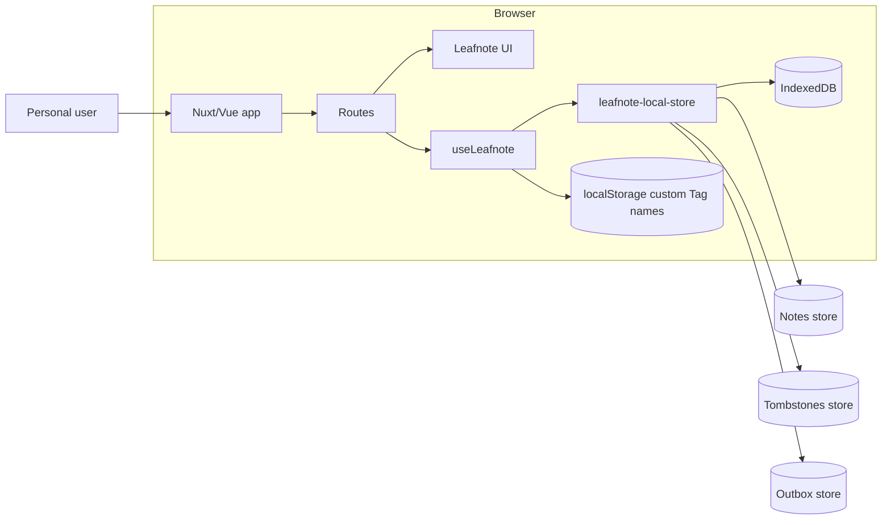
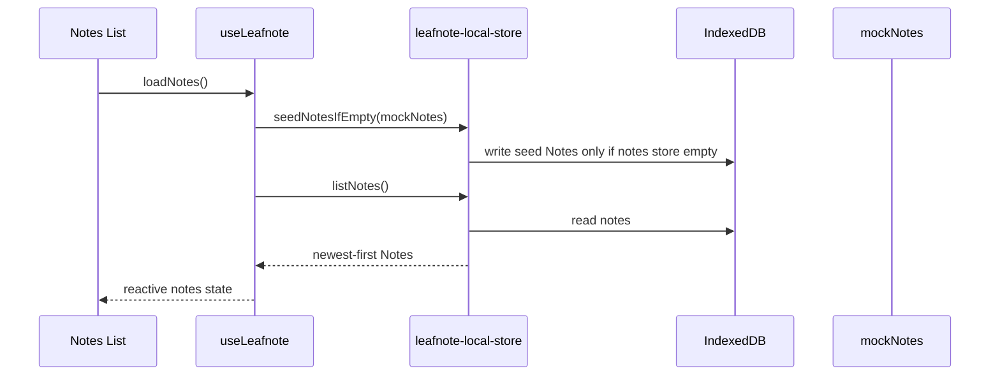
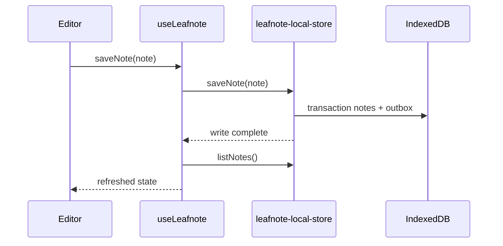
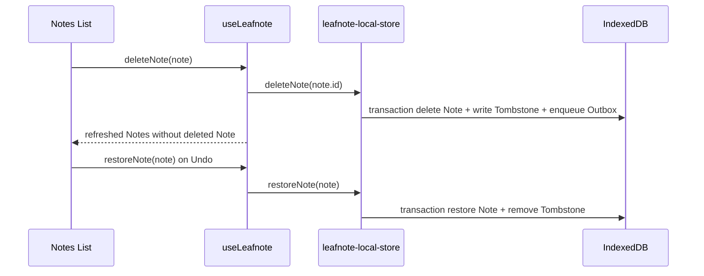

# Architecture Overview

Leafnote is a Nuxt 4 mobile web app for personal, Local-first note taking. The app is frontend-only: Notes are created, edited, searched, tagged, deleted, and restored in the browser before Sign-in or network access exists.

Current implementation after MVP Issues #1-#10:

- Vue 3 SFC routes under `app/pages/` render the mobile app.
- `useLeafnote()` is the app state facade used by routes.
- IndexedDB is the local source of truth for Notes, Tombstones, and Outbox entries.
- `app/data/mockNotes.ts` is seed data only, used when the local Notes store is empty.
- Custom Tag names currently also persist in `localStorage`; Tags attached to Notes persist through IndexedDB.
- Sign-in is a placeholder for future Sync. No real OAuth, backend, or Sync request exists.
- Sync copy is local-first: Local only, Saving, Saved, Syncing, Synced.

## 1. Project Structure

```text
app/
  app.vue                         Nuxt root app wrapper and UApp provider
  app.config.ts                   Nuxt UI app config and icons
  assets/css/main.css             Tailwind CSS 4, Leafnote design tokens, mobile shell utilities
  components/leafnote/            Leafnote UI modules
  composables/
    formatTimeAgo.ts              Relative time helper
    useLeafnote.ts                IndexedDB-backed app state facade
  data/mockNotes.ts               First-run seed Notes only
  pages/
    index.vue                     Welcome screen
    signin.vue                    optional Sync Sign-in placeholder
    settings.vue                  Settings screen
    search.vue                    local Search screen
    notes/index.vue               Notes List screen
    notes/[id].vue                Editor screen
  services/
    leafnote-local-store.ts       IndexedDB local persistence Module
    leafnote-editor-session.ts    Editor autosave/session Module used by tests
    leafnote-status.ts            status display copy/icons
    leafnote-tags.ts              Tag availability helper
    leafnote-search.ts            title/body Search helper
    leafnote-entrypoints.ts       Welcome/Sign-in copy/actions
    leafnote-settings.ts          Settings copy/status model
  types/note.ts                   Note type, default Tags, Tag storage key

docs/
  adr/                            architecture decision records
  architecture/                   architecture improvement plans
  issues/                         local issue backlogs
  prd/                            product requirements

CONTEXT.md                        domain glossary
ARCHITECTURE.md                   current architecture guide
AGENTS.md                         root agent instructions
app/AGENTS.md                     app-specific agent instructions
docs/AGENTS.md                    docs-specific agent instructions
```

Generated/build directories are not source architecture: `.nuxt/`, `.output/`, and `node_modules/`.

## 2. Runtime Diagram



Current hard constraints:

- No backend source files are present.
- No server API, OAuth callback, or Sync adapter is implemented.
- Local actions must not depend on network or Sign-in.
- Do not claim end-to-end encryption.

## 3. Main Modules

### 3.1 Routes

| Route | File | Role |
|---|---|---|
| `/` | `app/pages/index.vue` | Welcome entry point; Get Started goes to Notes; Sign in to sync goes to Sign-in |
| `/signin` | `app/pages/signin.vue` | Google/Apple placeholder Sign-in screen for future optional Sync |
| `/notes` | `app/pages/notes/index.vue` | Notes List, Tag filter, Delete/Undo banner, search/settings navigation |
| `/notes/:id` | `app/pages/notes/[id].vue` | Editor for existing Notes and `/notes/new` |
| `/search` | `app/pages/search.vue` | local Search by Note title/body only |
| `/settings` | `app/pages/settings.vue` | account placeholder, local Sync status, version, privacy copy |

### 3.2 `useLeafnote()` facade

`app/composables/useLeafnote.ts` is the route-facing app state facade.

It owns:

- `notes`: Nuxt `useState<Note[]>` hydrated from IndexedDB.
- `customTags`: Nuxt `useState<string[]>` hydrated from `localStorage`.
- `allTags`: default Tags + custom Tags + Tags attached to local Notes.
- `loadNotes()`: seeds first-run mock Notes if IndexedDB is empty, then loads local Notes.
- `saveNote()`: writes a Note through the local store, then refreshes state.
- `deleteNote()`: deletes a Note through the local store, then refreshes state.
- `restoreNote()`: restores a Note through the local store, then refreshes state.
- `findNote()`: finds a Note in current state.

The facade is intentionally the route seam. Pages should not call IndexedDB directly.

### 3.3 Local persistence Module

`app/services/leafnote-local-store.ts` owns IndexedDB access.

Current stores:

- `notes` keyed by `id`.
- `tombstones` keyed by `noteId`.
- `outbox` keyed by `id` with local write `sequence`.

Public interface:

- `saveNote(note, options?)`
- `listNotes()`
- `deleteNote(noteId, deletedAt?)`
- `restoreNote(note)`
- `listTombstones()`
- `listOutboxEntries()`
- `seedNotesIfEmpty(notes)`

Behaviour:

- New empty Notes are discarded unless `allowEmpty` is true.
- Existing Notes can be cleared and Saved until deleted.
- Notes are returned newest-first by `updatedAt`.
- Save writes the Note and an `upsertNote` Outbox entry.
- Delete removes the Note, writes a Tombstone, and enqueues a `deleteNote` Outbox entry atomically.
- Restore writes the Note back and removes its Tombstone.
- Note Tags are cloned before IndexedDB writes to avoid reactive/proxy clone errors.

### 3.4 Editor and Saved state

`app/pages/notes/[id].vue` currently owns route-level Editor state and Save status:

- loads the Note from `useLeafnote()` on mount;
- creates a client-generated ID for `/notes/new`;
- saves after 3 seconds idle;
- saves on blur, back navigation, and unmount;
- shows Local only/Saving/Saved via `LeafnoteSyncIndicator`.

`app/services/leafnote-editor-session.ts` mirrors the same autosave behaviour for integration-style tests. This duplication is tracked in `docs/issues/0002-post-mvp-architecture-issues.md`.

### 3.5 Delete, Tombstone, and Undo

Delete starts from `LeafnoteSwipeableNoteCard`, which opens confirmation. On confirm, `app/pages/notes/index.vue` calls `useLeafnote().deleteNote(note)`.

Current behaviour:

- confirmed Delete removes the Note from the Notes List immediately;
- local store writes a Tombstone and Outbox entry;
- page shows an Undo banner for 8 seconds;
- Undo calls `restoreNote(note)`, restoring the Note and removing the Tombstone;
- after the Undo window expires, the Note remains deleted.

### 3.6 Tags

Default Tags live in `app/types/note.ts`:

- personal
- work
- ideas
- journal
- recipes
- books

Current Tag persistence is mixed:

- Tags attached to Notes persist in IndexedDB.
- Custom Tag names are also stored in `localStorage` under `leafnote_custom_tags`.
- `getAvailableTags()` returns default Tags, custom Tags, and Tags attached to local Notes.

This mixed Tag path is known architecture debt and tracked in `docs/issues/0002-post-mvp-architecture-issues.md`.

### 3.7 Search

`app/services/leafnote-search.ts` owns Search matching. `/search` loads local Notes via `useLeafnote()` and calls `searchNotes(notes, query)`.

Search behaviour:

- blank query returns no results and shows the prompt;
- matches Note title and body only;
- ignores Tags;
- results update as the query changes;
- result cards open the selected Note.

### 3.8 Status, Welcome, Sign-in, and Settings

- `leafnote-status.ts` maps Local-first status values to copy/icon/tone.
- `leafnote-entrypoints.ts` owns Welcome and Sign-in copy/actions.
- `leafnote-settings.ts` owns Settings copy/status model.

Sign-in is not production auth. It is a placeholder for future optional Sync and uses Google/Apple buttons only.

## 4. Data Flow

### 4.1 First launch / Notes List



### 4.2 Save Note



### 4.3 Delete and Undo



## 5. Persistence

### IndexedDB

Database name: `leafnote` by default.

Version: `3`.

Stores:

| Store | Key | Purpose |
|---|---|---|
| `notes` | `id` | local Note source of truth |
| `tombstones` | `noteId` | local Delete records for future Sync |
| `outbox` | `id` | ordered local Note changes waiting for future Sync |

### localStorage

Current key:

- `leafnote_custom_tags`: custom Tag names entered in the Editor.

This is not used for Note content.

## 6. Validation and CI

Local validation commands:

```bash
pnpm test
pnpm typecheck
pnpm lint
pnpm build
```

Automated tests use Vitest and `fake-indexeddb` for local persistence behaviour.

Test files:

- `app/services/leafnote-local-store.test.ts`
- `app/services/leafnote-editor-session.test.ts`
- `app/services/leafnote-local-regression.test.ts`
- `app/services/leafnote-status.test.ts`
- `app/services/leafnote-tags.test.ts`
- `app/services/leafnote-search.test.ts`
- `app/services/leafnote-entrypoints.test.ts`
- `app/services/leafnote-settings.test.ts`

CI should run lint, typecheck, and tests. Production build is still recommended before handoff.

## 7. Known Architecture Debt

Tracked in `docs/issues/0002-post-mvp-architecture-issues.md`:

1. Refresh MVP Architecture and Agent Docs.
2. Deepen the local persistence Module.
3. Deepen the Note lifecycle Module.
4. Consolidate Tag persistence into one Local-first Tag Module.
5. Deepen the Note query Module for List and Search.
6. Deepen Delete and Undo into a Note removal Module.

## 8. Decisions

### Nuxt 4 frontend-only app

Leafnote is currently one Nuxt frontend app. There is no backend module.

### IndexedDB as local source of truth

ADR: `docs/adr/0001-indexeddb-as-local-source-of-truth.md`.

Notes, Tombstones, and Outbox entries are persisted locally in IndexedDB so Leafnote works before Sign-in/network.

### Last-write-wins future Sync

ADR: `docs/adr/0002-last-write-wins-sync-conflicts.md`.

Future Sync should preserve Outbox order and resolve conflicts by newest update time. Sync is not implemented in this repository.

## 9. Glossary

Use `CONTEXT.md` as the source of truth for domain terms: Note, Local-first, Outbox, Last-write-wins, Saved, Sync, Sign-in, Delete, Tombstone, Tag, Editor, Search, Settings, Welcome, Personal user.
